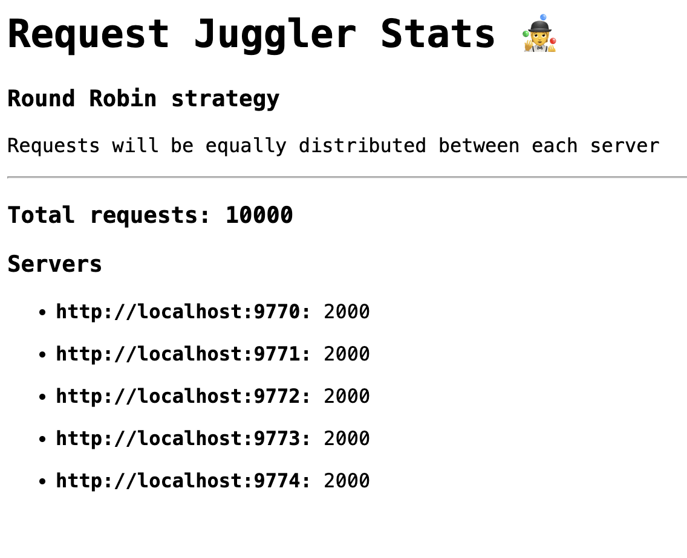

# Request Juggler

Simple load balancer written in Go.

It implements Round Robin strategy to pick the next server.

## Usage

### Run

There is a test api implementation ready to run using docker.
The servers will simply get a request and return "hello".

To run the 5 servers in the background

`docker-compose up -d`

To start the load balancer

`make run`

All the requests to index (`http://localhost:8080/`) will be proxied to one of the
five servers.

### Stats

Stats is a simple interface to check how many requests were received and it also
shows how many requests were processed by each server. Enjoy the beautiful UI.

Navigate to `http://localhost:8080/stats`, make requests and watch. It uses HTMX
to pull info from the server every 500ms.

I'm using [Bombardier](https://github.com/codesenberg/bombardier) to test it for convenience.
Sending 10k requests in total (1000 req/s).

`bombardier -n 10000 -r 1000 http://localhost:8080`

